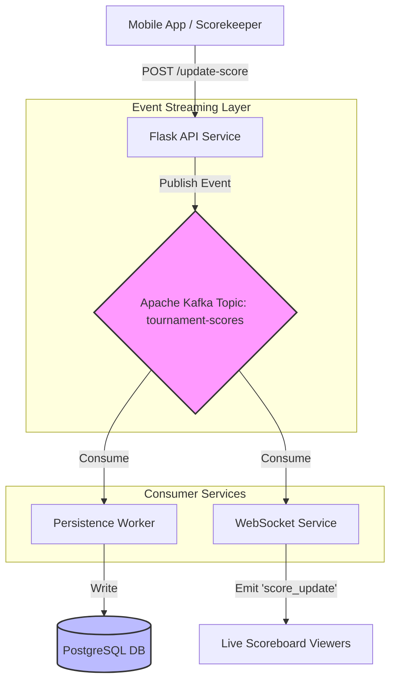

# Project Documentation

## Table of Contents
1. [How the current scoring mechanism works](#how-the-current-scoring-mechanism-works)
2. [What changes you made and why](#what-changes-you-made-and-why)
3. [Any schema or migration changes](#any-schema-or-migration-changes)
4. [What you would improve if you had more time](#what-you-would-improve-if-you-had-more-time)

---

## How the current scoring mechanism works

### Overview
The scoring system is designed to handle real-time score updates, match finalization, and automatic bracket progression. It uses a REST API for updates and WebSockets (Socket.IO) for real-time broadcasting to connected clients (scoreboards/displays).

### Architecture
The system follows a standard MVC pattern with an additional real-time layer:
1.  **Client Layer**: Sends score updates via HTTP POST and listens for updates via WebSocket.
2.  **API Layer (Flask)**: Processes the request, validates data, and updates the database.
3.  **Database Layer (SQLAlchemy)**: Persists match states and scores.
4.  **Real-time Layer (Socket.IO)**: Broadcasts the new state to all subscribers.

### Data Flow
1.  **Input**: Client sends `POST /update-score` with `match_id` and `score` (e.g., "11-9").
2.  **Validation**: Server checks if match exists and parses the score format.
3.  **Persistence**:
    *   Updates or Creates `Score` records for both teams.
    *   If `final=True`, determines the winner and updates `Match` status.
4.  **Progression**: If the match is part of a bracket (has a `successor`), the winner is automatically advanced to the next match.
5.  **Broadcast**: Server emits `score_update` event with the new state.

### Database Schema (Key Tables)
| Table | Key Fields | Description |
| :--- | :--- | :--- |
| **Match** | `id`, `team1_id`, `team2_id`, `winner_team_id`, `is_final`, `successor` | Represents a single match. Links to teams and the next match in the bracket. |
| **Score** | `match_id`, `team_id`, `score` | Stores the numeric score for a specific team in a specific match. |
| **Team** | `team_id`, `name`, `pool` | Represents a competing pair/team. |

### API Specification: Update Score
**Endpoint**: `POST /score/update-score`

**Payload**:
```json
{
  "match_id": "1",
  "score": "11-9",
  "tournament_id": "1",
  "final": true,
  "outcome": "normal" // Optional: "normal", "walkover"
}
```

**Logic**:
1.  **Parsing**: Splits score string ("11-9") -> Team 1: 11, Team 2: 9.
2.  **Recording**: Updates `Score` table for both teams.
3.  **Finalization** (if `final: true`):
    *   Compares scores to set `winner_team_id`.
    *   Sets `match.is_final = True`.
    *   **Walkover Handling**: If `outcome` is "walkover", explicitly sets winner from `winner_team_id` in payload.
    *   **Progression**: Triggers `update_successor_match` to propagate winner.

### Bracket Progression Logic
When a match is finalized:
1.  System checks `match.successor` (ID of the next match).
2.  It identifies if the current match is `predecessor_1` or `predecessor_2` of the successor.
3.  Updates the corresponding `team_id` slot in the successor match.
4.  Initializes 0-0 scores for the new matchup in the successor.

### Real-time Events
**Event**: `score_update`
**Namespace**: `/scores`
**Payload**:
```json
{
  "match_id": "1",
  "team1_score": 11,
  "team2_score": 9,
  "is_final": true,
  ...
}
```

---

## What changes you made and why

### 1. Introduction of `MatchOutcome` Enum in `models.py`
**Change**: Added the `MatchOutcome` Enum class to define standard outcomes.

```python
class MatchOutcome(str, Enum):
    NORMAL = 'normal'
    WALKOVER = 'walkover'
    FORFEIT = 'forfeit'
    BYE = 'bye'
```

**Why**: 
*   **Data Integrity**: Using Enums prevents invalid strings (like "WalkOver" vs "walkover") from entering the database.
*   **Code Readability**: It makes the code self-documenting. Instead of checking for magic strings like `'normal'`, we check `MatchOutcome.NORMAL`.
*   **Future Extensibility**: If we need to add a new field (e.g., `RAIN_DELAY`), we simply add it to the Enum class. We don't need to hunt down and change string literals throughout the entire codebase, making updates safe and instant.

### 2. Implementation of Walkover Logic
**Change**: Added specific handling for `outcome="walkover"` in the `update_score` function.

```python
if final:
    match.is_final = True
    
    # Handle Walkover
    outcome = data.get('outcome', 'normal')
    match.outcome = outcome
    
    if outcome == 'walkover':
        winner_team_id = data.get('winner_team_id')
        if not winner_team_id:
                return jsonify({'error': 'winner_team_id is required for walkover'}), 400
        match.winner_team_id = winner_team_id
        match.status = 'completed'
        print(f"Match walkover with winner_team_id: {match.winner_team_id}")
    else:
        # ... normal scoring logic ...
```

**Why**:
*   **Real-world Scenarios**: Tournaments often have no-shows. The system needed a way to advance a winner without requiring a played match score (e.g., 11-0 is not always accurate for a walkover).
*   **Mechanism**:
    *   When a walkover is reported, we bypass the score comparison logic.
    *   We explicitly trust the `winner_team_id` sent by the client.
    *   We mark the match as `completed` and `outcome='walkover'`.
    *   Crucially, we still trigger `update_successor_match`, ensuring the bracket doesn't break and the winner moves to the next round automatically.

---

## Any schema or migration changes

### Data Migration Pipeline
We implemented a robust data migration pipeline to populate the database from CSV files. This ensures that we can easily reset and re-seed the database with consistent test data.

#### 1. Source Data Files
*   **`sample_pools.csv`**: Contains the mapping of Team IDs to Pools (e.g., `T001` -> `Pool A`).
*   **`sample_teams.csv`**: Contains detailed information about teams and players (Name, Email, DUPR ID, Skill Level, etc.).

#### 2. Initialization Script (`init_db.py`)
This script acts as the primary ETL (Extract, Transform, Load) tool:
1.  **Hierarchy Creation**: Automatically creates the root `SuperTournament`, `Season`, and `Tournament` entities if they don't exist.
2.  **Pool Loading**: Reads `sample_pools.csv` into a dictionary for quick lookup.
3.  **Team & Player Creation**:
    *   Reads `sample_teams.csv`.
    *   **Player Creation**: Generates a unique UUID for each player, validates their `SkillType` against the Enum, and saves them to the `Player` table.
    *   **Team Creation**: Creates `Team` entries, linking them to the correct `Tournament` and assigning the `Pool` from the CSV data.
    *   **Linking**: Associates the created Players with their respective Teams (`player1_uuid`, `player2_uuid`).

#### 3. Match Generation (`generate_matches.py`)
Once the database is populated with Teams and Pools, this script generates the actual match fixtures:
1.  **Grouping**: Queries all teams and groups them by their assigned `Pool`.
2.  **Round Robin Logic**: Uses `itertools.combinations` to create a Round Robin schedule (every team plays every other team in their pool).
3.  **Match Creation**: Inserts `Match` records into the database with status `pending`, ready for scoring.

### Summary of Changes
*   **New Tables**: `Player` table added to store detailed player info (UUID, DUPR ID, etc.).
*   **Relationships**: `Team` table updated to link to `Player` via UUIDs (`player1_uuid`, `player2_uuid`).
*   **Enums**: `SkillType` enum added to enforce consistency in player skill levels during import.

---

## What you would improve if you had more time

### Optimization with Apache Kafka
Currently, the system handles score updates and broadcasting in a synchronous manner within the Flask application. While this works for a single tournament, it creates a bottleneck under high load (e.g., thousands of concurrent viewers or multiple simultaneous tournaments).

To scale this system, I would decouple the **Write** operations (Score Updates) from the **Read/Broadcast** operations using **Apache Kafka** as an event streaming platform.

#### Proposed Architecture
1.  **Producer (API Service)**: The Flask API receives the score update. Instead of writing to the DB and emitting to Socket.IO directly, it pushes a `ScoreUpdatedEvent` to a Kafka Topic (`tournament-scores`). This makes the API response extremely fast.
2.  **Kafka Cluster**: Acts as the high-throughput message broker, buffering events and ensuring order.
3.  **Consumer 1 (Persistence Service)**: Reads events from Kafka and updates the SQL Database. This ensures data integrity without slowing down the real-time flow.
4.  **Consumer 2 (Broadcast Service)**: A dedicated Node.js or Python service that reads from Kafka and broadcasts to connected WebSocket clients. This service can be scaled horizontally to handle millions of connections.

#### Schematic Diagram



#### Benefits
*   **High Throughput**: Kafka can handle millions of events per second, ensuring no lag during intense matches.
*   **Fault Tolerance**: If the Database goes down, the API stays up. Events are buffered in Kafka and replayed once the DB is back online.
*   **Scalability**: We can add more WebSocket servers dynamically to handle more viewers without touching the core scoring logic.
